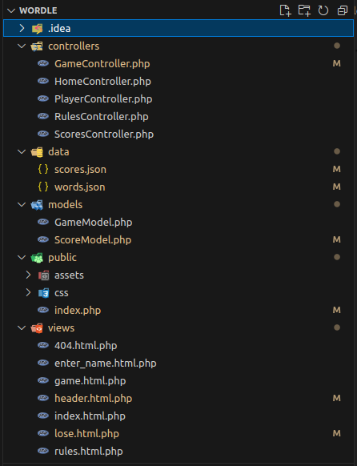

# Planète - Jeu d'Astronomie

**Planète** est un jeu interactif basé sur l'astronomie où les joueurs doivent deviner des mots en lien avec l'univers et les planètes. Le projet utilise PHP pour la logique côté serveur, avec un stockage des données en fichier JSON et une génération d'images dynamique pour afficher les scores.

## Structure du projet

Le projet est organisé en différentes sections comme suit :




## Fonctionnalités principales

### 1. **Affichage des scores avec GD**

L'une des fonctionnalités principales du projet est la génération dynamique d'un tableau des scores sous forme d'image avec la bibliothèque GD de PHP. Lorsque le joueur termine une partie, ses résultats sont ajoutés à un fichier JSON, et un tableau des scores est généré à l'aide de GD pour afficher les scores de tous les joueurs.

- **Image des scores** : Le tableau des scores est créé sous forme d'image, et chaque joueur est affiché avec son score sur cette image.

### 2. **Système de règles et démo**

Le projet comporte une page expliquant les règles du jeu, où l'utilisateur peut consulter les instructions pour savoir comment jouer. Cette page est gérée par le `RulesController.php`.

### 3. **Gestion des scores avec JSON**

Les scores des joueurs sont stockés dans un fichier `scores.json`, ce qui permet de conserver les données même après la fin de chaque session. Ce fichier est mis à jour chaque fois qu'un joueur termine une partie.

- **Lecture des scores** : Les scores sont récupérés et affichés dans le tableau des scores via une image générée avec GD.


### 4. **Utilisation des fichiers JSON pour le stockage**

Le projet utilise des fichiers JSON pour stocker les données relatives aux **mots** à deviner et les **scores** des joueurs. Ces fichiers sont chargés par les modèles `GameModel.php` et `ScoreModel.php` et sont modifiés lorsque des événements se produisent dans le jeu (comme un score gagné ou modifié).

### 5. **Structure MVC**

Le projet suit une architecture **MVC (Model-View-Controller)** où :

- **Les contrôleurs** gèrent la logique et les interactions avec l'utilisateur.
- **Les modèles** interagissent avec les fichiers JSON pour récupérer ou enregistrer des données.
- **Les vues** sont des fichiers HTML qui sont envoyés à l'utilisateur pour afficher les informations et les interactions.

### 6. **Utilisation des sessions PHP**

Le jeu utilise des sessions PHP pour stocker les informations de chaque joueur, telles que son nom, ses scores et ses tentatives. Cela permet de garder la trace de chaque session de jeu et de personnaliser l'expérience de chaque joueur.

---

## Étapes de développement

### 1. **Initialisation du projet**

J'ai commencé par définir la structure de base du projet en PHP. J'ai créé les fichiers nécessaires pour les **contrôleurs**, **modèles** et **vues**, et j'ai configuré un premier fichier `index.php` pour gérer le routage des pages.

### 2. **Création de la logique de jeu**

Ensuite, j'ai implémenté la logique de base du jeu dans le `GameController.php`, où le joueur doit deviner des mots en lien avec l'astronomie. Le jeu commence lorsqu'un joueur entre son nom via un formulaire dans la vue `enter_name.html.php`.

### 3. **Gestion des scores avec JSON**

J'ai créé le modèle `ScoreModel.php` pour gérer les scores des joueurs. J'ai utilisé un fichier JSON pour stocker et récupérer les scores. Cette approche m'a permis de conserver les données entre les sessions de jeu.

### 4. **Génération de l'image avec GD**

Pour le tableau des scores, j'ai utilisé la bibliothèque GD de PHP pour générer une image dynamique. J'ai créé une fonction dans le `ScoresController.php` qui génère l'image chaque fois que les scores sont affichés ou mis à jour.

### 5. **Ajout de la page des règles**

J'ai ensuite ajouté une page expliquant les règles du jeu dans le `RulesController.php`. Cela permet à l'utilisateur de comprendre le fonctionnement du jeu avant de commencer.

### 6. **Gestion des interactions et des sessions**

J'ai utilisé des sessions PHP pour stocker les informations du joueur, comme son nom et son score actuel, pour les réutiliser au cours de la partie.


### 7. **Améliorations et tests**

Enfin, j'ai testé l'ensemble du projet pour m'assurer que tout fonctionnait correctement. J'ai ajouté des fonctionnalités comme la possibilité de modifier un score uniquement pour son propre profil, tout en empêchant les autres joueurs de tricher.

---


## Comment démarrer

1. Clonez ce repository sur votre machine locale.
2. Assurez-vous d'avoir **PHP** et **GD** installés sur votre serveur.
3. Placez le projet dans un répertoire accessible via votre serveur web.
4. Ouvrez le fichier `index.php` dans votre navigateur pour commencer à jouer !

---

N'hésitez pas à ajouter plus de fonctionnalités à ce projet, telles que l'intégration d'une base de données ou l'amélioration de la gestion des sessions. Ce projet peut être facilement étendu et personnalisé selon vos besoins.

### 6. **Autoloader pour les contrôleurs et modèles**

Le projet utilise un système d'**autoloader** pour charger automatiquement les classes des **contrôleurs** et **modèles**, à la manière de frameworks comme Laravel. Cela simplifie la gestion du projet en évitant d'avoir à inclure manuellement chaque fichier de classe.

#### Exemple d'Autoloader dans `index.php` :

```php
// Autoloader pour les contrôleurs et modèles
spl_autoload_register(function ($class) {
    $paths = [
        '../controllers/',   // Répertoire des contrôleurs
        '../models/'         // Répertoire des modèles
    ];

    foreach ($paths as $path) {
        $file = $path . $class . '.php';
        if (file_exists($file)) {
            require_once $file;
            return;
        }
    }
});